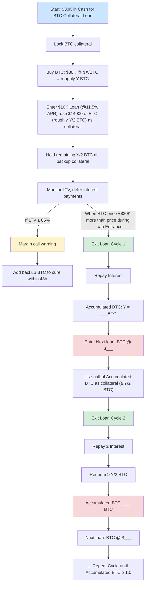
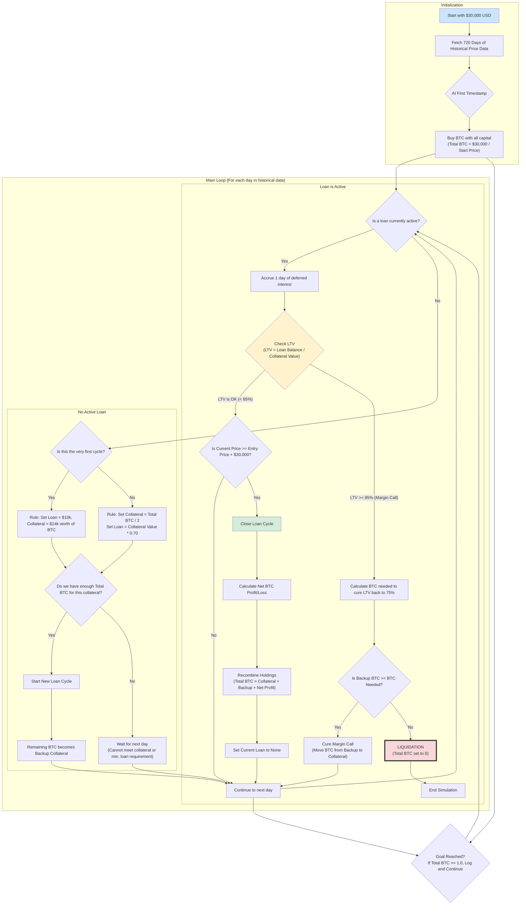

## Initial Mermaid:

```mermaid
graph TD
  A["Start: $30K in Cash for BTC Collateral Loan"] --> B["Lock BTC collateral"]
  B --> C["Buy BTC: $30K @ $X/BTC = roughly Y BTC"]
  C --> D["Enter $10K Loan (@11.5% APR), use $14000 of BTC (roughly Y/2 BTC) as collateral"] 
  D --> E["Hold remaining Y/2 BTC as backup collateral"]
  E --> F["Monitor LTV, defer interest payments"]

  F -->|If LTV ≥ 85%| G["Margin call warning"]
  G --> H["Add backup BTC to cure within 48h"]

  F -->|When BTC price +$30K more than price during Loan Entrance| I1["Exit Loan Cycle 1"]
  I1 --> J1["Repay Interest"]
  J1 --> K1["Accumulated BTC: Y = ___BTC"]
  K1 --> L1["Enter Next loan: BTC @ $___"]
  L1 --> M1["Use half of Accumulated BTC as collateral (≥ Y/2 BTC)"]

  M1 --> I2["Exit Loan Cycle 2"]
  I2 --> J2["Repay ≥ Interest"]
  J2 --> K2["Redeem ≥ Y/2 BTC"]
  K2 --> L2["Accumulated BTC: ___ BTC"]
  L2 --> M2["Next loan: BTC @ $___"]

  M2 --> Z["... Repeat Cycle until Accumulated BTC ≥ 1.0"]

  style A fill:#cce5ff
  style I1 fill:#d4edda
  style I2 fill:#d4edda
  style G fill:#fff3cd
  style L1 fill:#f8d7da
  style L2 fill:#f8d7da
```

---

## Google Gemini Mermaid:

```mermaid

graph TD
    subgraph Initialization
        A["Start with $30,000 USD"] --> B["Fetch 720 Days of Historical Price Data"];
        B --> C{"At First Timestamp"};
        C --> D["Buy BTC with all capital<br>(Total BTC = $30,000 / Start Price)"];
    end

    subgraph "Main Loop (For each day in historical data)"
        D --> E{"Is a loan currently active?"};

        subgraph "Loan is Active"
            E -- Yes --> F["Accrue 1 day of deferred interest"];
            F --> G{"Check LTV<br>(LTV = Loan Balance / Collateral Value)"};

            G -- "LTV is OK (< 85%)" --> H{"Is Current Price >= Entry Price + $30,000?"};
            H -- No --> LoopEnd["Continue to next day"];

            H -- Yes --> I["Close Loan Cycle"];
            I --> J["Calculate Net BTC Profit/Loss"];
            J --> K["Recombine Holdings<br>(Total BTC = Collateral + Backup + Net Profit)"];
            K --> L["Set Current Loan to None"];
            L --> LoopEnd;

            G -- "LTV >= 85% (Margin Call)" --> M["Calculate BTC needed to cure LTV back to 75%"];
            M --> N{"Is Backup BTC >= BTC Needed?"};
            N -- Yes --> O["Cure Margin Call<br>(Move BTC from Backup to Collateral)"];
            O --> LoopEnd;
            N -- No --> P["LIQUIDATION<br>(Total BTC set to 0)"];
            P --> EndSim["End Simulation"];
        end

        subgraph "No Active Loan"
            E -- No --> Q{"Is this the very first cycle?"};

            Q -- Yes --> R["Rule: Set Loan = $10k, Collateral = $14k worth of BTC"];
            R --> T{"Do we have enough Total BTC for this collateral?"};

            Q -- No --> S["Rule: Set Collateral = Total BTC / 2<br>Set Loan = Collateral Value * 0.70"];
            S --> T;

            T -- Yes --> U["Start New Loan Cycle"];
            U --> V["Remaining BTC becomes Backup Collateral"];
            V --> LoopEnd;

            T -- No --> W["Wait for next day<br>(Cannot meet collateral or min. loan requirement)"];
            W --> LoopEnd;
        end
    end

    LoopEnd --> E;
    D --> EndSim2{"Goal Reached?<br>If Total BTC >= 1.0, Log and Continue"};
    LoopEnd --> EndSim2;
    EndSim2 --> E;

    style A fill:#cce5ff
    style I fill:#d4edda
    style G fill:#fff3cd
    style P fill:#f8d7da,stroke:#333,stroke-width:4px

```